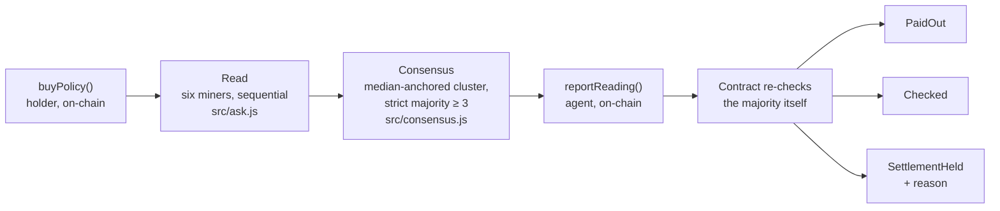

<div align="center">

# Nimbi

### Weather cover that checks its sources before it pays

[](https://github.com/IamHarrie-Labs/nimbi-weather-cover/actions/workflows/ci.yml)
[](LICENSE)
[](https://sepolia.basescan.org/address/0x3C978900248E7180593fCb3dB97Ce6F1BE7A1908)
[](src/miners.js)
[](#the-finding-one-oracle-one-number-five-cities)
[](#verify-it-yourself-right-now)

A holder buys cover against a temperature threshold at a place. Nimbi asks six independent Telegraph miners the same question and only pays when a real majority of them agree. Disagreement gets held, not guessed at, and the reason is written on-chain.

Built for the [Telegraph Protocol Hackathon](https://hackathon.telegraphprotocol.com/), Season I, Application track.

**[Live site](https://nimbi-project.onrender.com/)** · [The finding](#the-finding-one-oracle-one-number-five-cities) · [Verify it yourself](#verify-it-yourself-right-now) · [Architecture](#architecture) · [Decisions](#decisions-worth-explaining) · [Limitations](#whats-real-and-what-isnt)

</div>

---

## Contents

- [The problem](#the-problem)
- [What Nimbi is](#what-nimbi-is)
- [The finding: one oracle, one number, five cities](#the-finding-one-oracle-one-number-five-cities)
- [The consensus rule](#the-consensus-rule)
- [The three outcomes](#the-three-outcomes)
- [Verify it yourself right now](#verify-it-yourself-right-now)
- [Architecture](#architecture)
- [Decisions worth explaining](#decisions-worth-explaining)
- [What's real, and what isn't](#whats-real-and-what-isnt)
- [Run it yourself](#run-it-yourself)
- [Project layout](#project-layout)

## The problem

A parametric weather product is only as good as the temperature reading it settles on, and most of them trust exactly one source. Nothing stops that source from going stale, misreporting a unit, or simply returning the wrong number, and nothing downstream would notice, because nothing downstream is checking.

## What Nimbi is

A settlement contract and an off-chain agent that, together, refuse to act on a single unverified reading:

1. **Read** the agent asks six independent Telegraph miners the same question about the same place, right now.
2. **Consensus** it finds whichever miners actually cluster together, requires a strict majority of at least three, and names anything outside that cluster as excluded rather than averaging it in.
3. **Settle** the contract independently re-checks that the reported majority really is a majority (an agent can't fake the count), then pays out, checks, or holds, and records which on-chain.

## The finding: one oracle, one number, five cities

While building this, a multi-city survey (`src/survey.js`, raw output in [`build/survey.json`](build/survey.json)) turned up a miner reporting an identical temperature everywhere it was asked:

| City | Real median (5 other miners) | `chainsight-oracle` reported |
|---|---:|---:|
| Cairo | 28.6°C | **40.50°C** |
| Lagos | 25.95°C | **40.50°C** |
| London | 14.35°C | **40.50°C** |
| Singapore | 32.97°C | **40.50°C** |
| Reykjavik | 7.95°C | **40.50°C** |

Reykjavik and Cairo do not share a climate, 20 degrees apart on the day this was measured, and `chainsight-oracle` returned the exact same figure for both, down to the second decimal. That's not a measurement. It's a constant standing in for one.

Nimbi's consensus rule catches this without ever being told which miner is broken: it just notices that five miners cluster together and one doesn't, and excludes the one that doesn't. Reproduce it yourself:

```bash
node src/survey.js            # asks all six miners about all five cities, live
```

## The consensus rule

The naive version of this, every reading within tolerance of every other, sounds strict and is actually useless: one miner stuck on a constant would veto every settlement in every city, forever. `src/consensus.js` instead does what distributed systems have always done:

- find the cluster of readings within tolerance of the median (median because it can't be dragged by an outlier the way a mean can)
- require that cluster to be a strict majority of at least three miners
- report the *cluster's* spread as the tightness check, not the full spread across every miner including the excluded one

The majority check is enforced **twice**, once by the agent that proposes it and once by the contract itself on-chain (`minersAgreeing * 2 > minersTotal`), so an agent that lied about which side won still cannot settle on a fringe.

## The three outcomes

| Outcome | Condition | What moves |
|---|---|---|
| **Paid out** | Majority agreed, threshold crossed | Payout to the holder, immediately |
| **Checked** | Majority agreed, threshold not crossed | Nothing. Not a failure, just no trigger |
| **Held** | No majority, too few miners, or spread too wide | Nothing. The specific reason is written on-chain |

Every one of the 3 real settlements below actually happened on the live contract, not seeded fixtures:

| Policy | Place | Condition | Outcome | Miners agreeing |
|---|---|---|---|---:|
| #0 | Cairo | ≥ 23.0°C | **Paid out** | 5 of 6 |
| #2 | Cairo | ≥ 23.0°C | **Held** (spread too wide) | 2 of 6 |
| #4 | London | ≤ 30.0°C | **Paid out** | 5 of 5 |

## Verify it yourself right now

No wallet, no setup. These hit the live API directly:

```bash
curl "https://nimbi-project.onrender.com/api/consensus?place=cairo"   # live 6-miner read, right now
curl "https://nimbi-project.onrender.com/api/ledger"                  # every policy and how it settled
```

The first call can take 20 to 40 seconds. That's not a slow API, that's six sequential real network calls to independent miners. The site's own free host also sleeps after inactivity, so a cold first hit can add another 30 to 60 seconds on top, before any of that reading even starts.

Or check the consensus rule itself, offline, no network at all:

```bash
git clone https://github.com/IamHarrie-Labs/nimbi-weather-cover && cd nimbi-weather-cover
npm install
npm test   # 18 cases, several taken from the real chainsight-oracle data above
```

## Architecture



`src/server.js` is the only thing holding the agent's private key; it never reaches the browser. The buy flow (mint, approve, buy) is signed entirely by the visitor's own wallet and never touches the backend at all.

## Decisions worth explaining

| Decision | Why it mattered |
|---|---|
| Majority-cluster rule instead of "everyone agrees" | The naive rule made 0 of 5 surveyed cities ever settle, because one broken miner vetoed all of them. Cover that can never pay isn't cover. |
| Majority re-checked on-chain, not just by the agent | Without this, a compromised agent could report "3 of 100 agree" and settle on a fringe. The contract now can't be lied to about the count. |
| Settlement token is a mock USDC with public `mint()` | Chosen over Circle's canonical testnet USDC specifically so a stranger can fund and buy a policy in one visit, no faucet queue. |
| All chain reads wrapped in retry logic (`src/rpc.js`) | Base Sepolia's public RPC drops connections often enough that a script doing more than two transactions in a row will hit one. Reverts are never retried; only transport failures are. |
| Every live miner read serialized through one queue | Telegraph's engine allows one outstanding request per wallet, across every websocket, not per connection. Two concurrent reads on the same agent wallet collide; this repo found that bug live, then fixed it. |

## What's real, and what isn't

**Real:** every reading comes from live Telegraph miners over the `ask_direct` protocol, no fixtures. The 3 settlements in the table above happened on the deployed contract. The 5-city chainsight-oracle finding is a live, reproducible measurement, not a staged example.

**Explicitly not claimed:**

- **This is not insurance.** No real risk transfer, no underwriting, no regulatory product. It's testnet play-money USDC on Base Sepolia, stated on every page rather than in fine print.
- **Live miner data varies between runs**, because it's real weather data, not fixtures. A "Held" result someone sees might reflect that specific moment's actual disagreement, not a bug.
- **A cluster of 5 out of 6 still leaves room for two broken miners to outvote four good ones**, in principle. The majority rule assumes most miners are usually right; it does not prove any individual miner is honest.
- **The x402 micropayment escrow that funds live miner reads is a shared, drainable resource** (`src/escrow.js`). Enough traffic exhausts it, and every read fails until it's topped up. This has happened during the project's own testing.

## Run it yourself

```bash
npm install
cp .env.example .env    # fill in AGENT_PRIVATE_KEY, testnet only, never fund with mainnet assets
npm run server           # http://localhost:8787

node src/build.js        # compile the contract
node src/deploy.js 20    # deploy + seed pool with $20 test USDC
node src/e2e.js cairo    # exercise all three settlement outcomes against live miners
node src/escrow.js       # check the miner-query escrow balance
node src/escrow.js deposit 10   # top it up if reads start failing
```

## Project layout

```
contracts/WeatherGuard.sol   settlement contract: premiums, payouts, majority check, disagreement recorded
src/consensus.js             the majority-cluster agreement rule
src/ask.js                   talks to Telegraph miners over ask_direct
src/miners.js                the six miner subnet IDs and the five places priced
src/server.js                backend: live reads, the ledger, settle-on-demand. Holds the agent key
src/deploy.js  src/admin.js  src/escrow.js  src/survey.js   deployment, pool and escrow maintenance, the multi-city survey
public/                      index.html (landing), buy.html (wallet-gated buy/settle), docs.html, shared styles.css / motion.js / app.js
```
